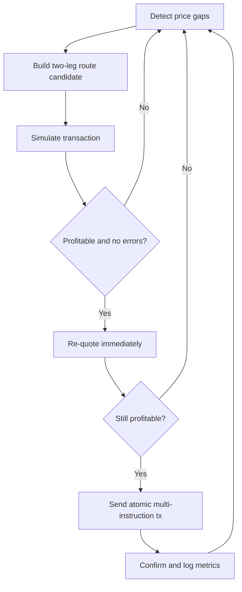

# Solana Arbitrage Bot (Hackathon Scaffold)

This bot scans cross-DEX round trips (`A -> B -> A`), simulates the bundled transaction, optionally re-quotes, and executes only when expected profit stays above your threshold.

## What is implemented

- Cross-DEX detection loop using Jupiter quotes with per-DEX filtering (`Raydium`, `Orca`, etc.).
- Two-leg atomic transaction builder (single Solana v0 transaction).
- Preflight simulation via `simulateTransaction`.
- Optional re-quote before execution.
- Priority fees + compute budget instructions.
- Multi-wallet workers (route sharding) to reduce account contention.
- JSON logs and optional metrics output.

## Install

Run from the project root:

```bash
npm install
```

## Configure

Copy values from `.env.arb.example` into your own `.env`.

Security rules:

- Do not hardcode secrets in code.
- Never commit `.env`.
- Use dedicated low-balance hot wallets for testing.
- For production signing, use KMS/HSM where possible.

## Run

Detect-only single cycle:

```bash
npm run arb:once
```

Continuous loop (dry run):

```bash
npm run arb:dev
```

Live execution (only after testing):

1. Set `ARB_DRY_RUN=false`
2. Set `ARB_AUTO_EXECUTE=true`
3. Ensure wallet and token accounts are funded
4. Run `npm run arb:dev`

## Key environment variables

- `SOLANA_RPC_URL`: RPC endpoint for reads/writes.
- `JUPITER_API_BASE`: default is `https://quote-api.jup.ag/v6`.
- `ARB_DEXES`: comma-separated DEX labels (`Raydium,Orca`).
- `ARB_ROUTES_JSON`: JSON array of routes.
- `ARB_MIN_PROFIT_BPS` / `ARB_MIN_PROFIT_ATOMIC`: profit filters.
- `ARB_SLIPPAGE_BPS`: quote slippage.
- `ARB_COMPUTE_UNIT_PRICE_MICROLAMPORTS`: priority fee.
- `SOLANA_PRIVATE_KEY_JSON`: single wallet secret byte array.
- `SOLANA_PRIVATE_KEYS_JSON`: array of secret byte arrays for parallel workers.

## Mermaid flow



## Notes

- Jupiter API fields can evolve; if responses change, update `src/solana-arb/jupiterClient.ts`.
- This scaffold focuses on hackathon speed, not production hardening.
- Keep trade sizes tiny until real fill quality and failure modes are measured.
